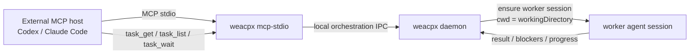
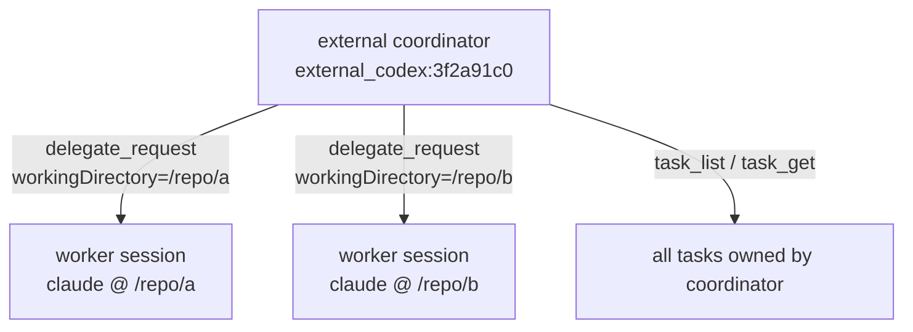
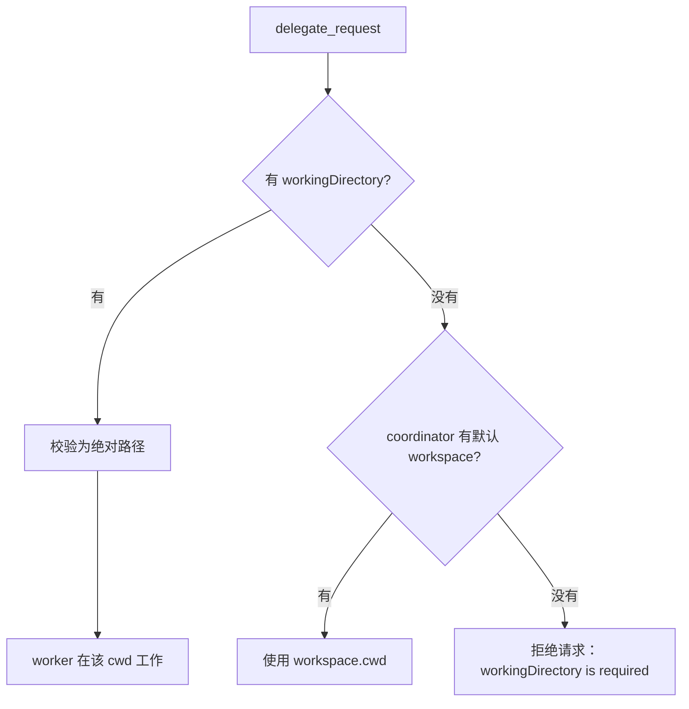
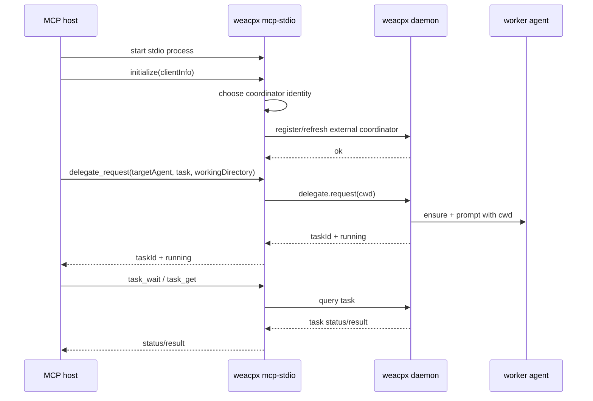

# External MCP coordinator

`weacpx mcp-stdio` 是标准 MCP stdio server。Codex、Claude Code 等外部 MCP host 可以通过它调用 weacpx 的编排工具，例如 `delegate_request`、`task_get`、`task_list`、`task_wait`。

核心目标：让“当前正在使用的 coding agent”成为 coordinator，把子任务派给其他 agent，同时让被派出去的 worker 明确知道自己应该在哪个目录工作。

## 一句话模型

- **MCP host / 当前 agent**：coordinator，负责拆任务和看结果。
- **`weacpx mcp-stdio`**：很薄的 stdio shim，只负责把 MCP tool call 转成 weacpx daemon 的本地 RPC。
- **weacpx daemon**：真正保存 coordinator、task、worker binding 等编排状态。
- **worker agent**：被 `delegate_request` 派出去的 Claude / Codex / opencode 会话。
- **`workingDirectory`**：任务级工作目录。它决定 worker 在哪里工作，不决定 coordinator identity。



## 最小配置

先启动 daemon：

```bash
weacpx start
weacpx status
```

然后把 MCP server 配到外部 host：

```json
{
  "mcpServers": {
    "weacpx": {
      "command": "weacpx",
      "args": ["mcp-stdio"]
    }
  }
}
```

这时不需要 `--workspace`。weacpx 会给这个 MCP 子进程生成一个进程级 external coordinator identity，例如：

```text
external_codex-mcp-client:3f2a91c0
```

这个 identity 只表示“这个 MCP 子进程代表哪个 coordinator”，不绑定任何目录。

## 委派任务时传 workingDirectory

外部 MCP host 调用 `delegate_request` 时，应传入当前项目的绝对路径：

```json
{
  "targetAgent": "claude",
  "task": "审查当前改动，找出 3 个高风险点",
  "workingDirectory": "/absolute/path/to/repo"
}
```

Windows 示例：

```json
{
  "targetAgent": "claude",
  "task": "审查当前改动，找出 3 个高风险点",
  "workingDirectory": "E:\\projects\\weacpx"
}
```

要求：

- `workingDirectory` 必须是非空绝对路径。
- 这个路径不要求提前注册为 weacpx workspace。
- weacpx 不用 MCP roots 猜目录，也不会用 daemon 或 MCP 子进程的 `process.cwd()` 兜底。
- 如果 external coordinator 没有默认 workspace，`delegate_request` 不传 `workingDirectory` 会失败。

这是故意的：派遣任务时必须确定 worker 到底在哪里工作，不能靠不确定的 host 行为推断。

## 为什么不把 path 放进 coordinator identity

coordinator identity 和 worker cwd 是两个不同问题：

| 概念 | 作用 | 是否包含 path |
| --- | --- | --- |
| external coordinator identity | 标识“哪个 MCP host / MCP 子进程在当主控” | 默认不包含 |
| `workingDirectory` | 标识“这次派出去的 worker 到哪里工作” | 是 |
| worker session | 标识某个 target agent 在某个 coordinator + cwd 下的工作会话 | 会按 cwd 区分 |

如果把 path 放进 coordinator identity，会有两个问题：

1. 同一个 Codex / Claude Code 会话想派 agent 去另一个目录时，会被迫变成另一个 coordinator。
2. `task_get`、`task_list`、`task_wait` 这类只和 coordinator 相关的查询也会被 path 污染。

所以 weacpx 的规则是：

- coordinator identity 表示主控身份。
- `workingDirectory` 表示任务执行位置。
- worker session 会按 cwd 区分，避免同一个 coordinator 在不同目录派同一个 agent 时互相抢会话。



## 多开 Codex / Claude Code 会不会冲突

默认不会共用同一个 external coordinator。

不传 `--coordinator-session` 时，每个 `weacpx mcp-stdio` 进程会生成一个进程级 identity：

```text
external_<client-name>:<process-instance-id>
```

所以你在不同目录打开多个 Codex / Claude Code，通常每个 MCP stdio 子进程都会是独立 coordinator。它们可以分别在自己的 `workingDirectory` 下派任务。

如果你显式传了同一个 `--coordinator-session`，那就是你主动要求多个 MCP host 共享同一个 coordinator identity。只有在你确实想共享任务列表和编排上下文时才这样做。

## Windows 配置示例

不要把 `node E:\projects\weacpx\dist\cli.js` 整串写进 `command`。很多 MCP host 会把 `command` 当成文件名执行，从而报：

```text
文件名、目录名或卷标语法不正确。 (os error 123)
```

正确写法：`command` 只放可执行文件；脚本路径和参数放到 `args`。

```json
{
  "type": "stdio",
  "command": "D:\\Users\\you\\.nvmd\\versions\\22.19.0\\node.exe",
  "args": [
    "E:\\projects\\weacpx\\dist\\cli.js",
    "mcp-stdio"
  ]
}
```

如果全局安装了 `weacpx`，并且 MCP host 能找到它，也可以：

```json
{
  "type": "stdio",
  "command": "weacpx",
  "args": ["mcp-stdio"]
}
```

## 可选：显式 coordinator session

默认进程级 identity 适合大多数场景。如果你希望 MCP host 重启后继续使用同一个 coordinator identity，可以显式指定：

```json
{
  "mcpServers": {
    "weacpx": {
      "command": "weacpx",
      "args": ["mcp-stdio", "--coordinator-session", "codex:daily-review"]
    }
  }
}
```

效果：

- `task_list` 会看到这个固定 coordinator 之前留下的任务。
- 多个 MCP host 如果配置同一个 `--coordinator-session`，会共享同一组任务。
- 仍然建议每次 `delegate_request` 显式传 `workingDirectory`。

注意：不要随手让多个活跃 host 共用同一个 coordinator identity。除非你明确想共享编排上下文，否则默认进程级 identity 更安全。

## 可选：默认 workspace（兼容模式）

`--workspace` 仍然可用，但它只是给这个 MCP server 提供一个默认工作区，不是推荐的外部 MCP 配置方式：

```bash
weacpx mcp-stdio --workspace backend
```

这要求 `backend` 已经存在于 `~/.weacpx/config.json`：

```bash
cd /absolute/path/to/repo
weacpx workspace add backend
```

之后如果 `delegate_request` 没传 `workingDirectory`，weacpx 会使用 workspace `backend` 的 cwd。

这适合旧配置或非常固定的单仓库 MCP 配置；如果你经常在不同项目目录打开 Codex / Claude Code，建议不要在 MCP 启动参数里绑定 workspace，而是在 tool call 里传 `workingDirectory`。

## 为什么不依赖 MCP roots 或 process.cwd()

有些 MCP host 支持 roots，有些不支持；有些会返回多个 roots；有些 roots 只表示“打开的文件夹”，不一定等于当前 agent 真正要工作的目录。

`process.cwd()` 也不是可靠契约：它取决于 MCP host 如何启动 stdio server。某些 host 会在项目目录启动，某些 host 会在固定目录启动，还有些配置会经过 wrapper。

weacpx 的外部 MCP 选择更严格的规则：



这样可以保证派出去的 agent 的工作目录是确定的。

## 启动与调用流程



## 常用工具

外部 coordinator 常用工具：

- `delegate_request`：派出一个子任务。推荐传 `workingDirectory`。
- `task_get`：查看单个任务。
- `task_list`：列出当前 coordinator 的任务。
- `task_wait`：等待任务完成或进入需要处理的状态。默认最多等待 5 分钟；可传 `timeoutMs` 调整，最大 20 分钟。
- `task_cancel`：取消任务。
- `group_new` / `group_list` / `group_cancel`：管理任务组。

`task_get` / `task_list` / `task_wait` 不需要 `workingDirectory`，因为它们查的是 coordinator 名下的任务，不是新开 worker。

## 故障排查

### `cannot infer workspace from MCP roots`

旧版本或旧文档会建议依赖 roots 自动推导 workspace。现在推荐做法是不依赖 roots：

- MCP 启动参数用 `weacpx mcp-stdio`。
- 派任务时传 `workingDirectory`。

### `workingDirectory is required`

说明当前 external coordinator 没有默认 workspace，而 `delegate_request` 没传工作目录。

修法：让调用方补上：

```json
{
  "targetAgent": "claude",
  "task": "...",
  "workingDirectory": "/absolute/path/to/repo"
}
```

### `workingDirectory must be an absolute path`

传入了相对路径。改成绝对路径。

### Windows `os error 123`

`command` 写错了。不要把可执行文件和参数写成一整串；`command` 只写 `node.exe` 或 `weacpx`，其它放 `args`。

### `Cannot find module '...dist\\cli.js'`

脚本路径不存在或写错。先在终端里直接验证：

```powershell
& "D:\Users\you\.nvmd\versions\22.19.0\node.exe" "E:\projects\weacpx\dist\cli.js" "mcp-stdio"
```

如果本地开发版本还没 build，先运行：

```bash
bun run build
```

### 任务创建了但 worker 没结果

先查 daemon：

```bash
weacpx status
weacpx doctor --verbose
```

再查日志：

```bash
# macOS / Linux
 tail -n 200 ~/.weacpx/runtime/app.log

# Windows PowerShell
Get-Content C:\Users\you\.weacpx\runtime\app.log -Tail 200
```

常见原因：目标 agent 不可用、底层 acpx 启动失败、worker 会话被占用、权限策略阻止执行。
