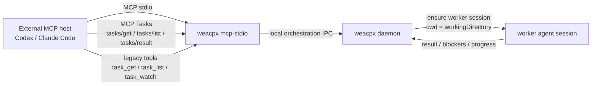
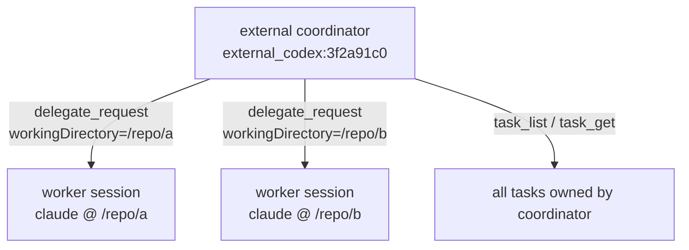
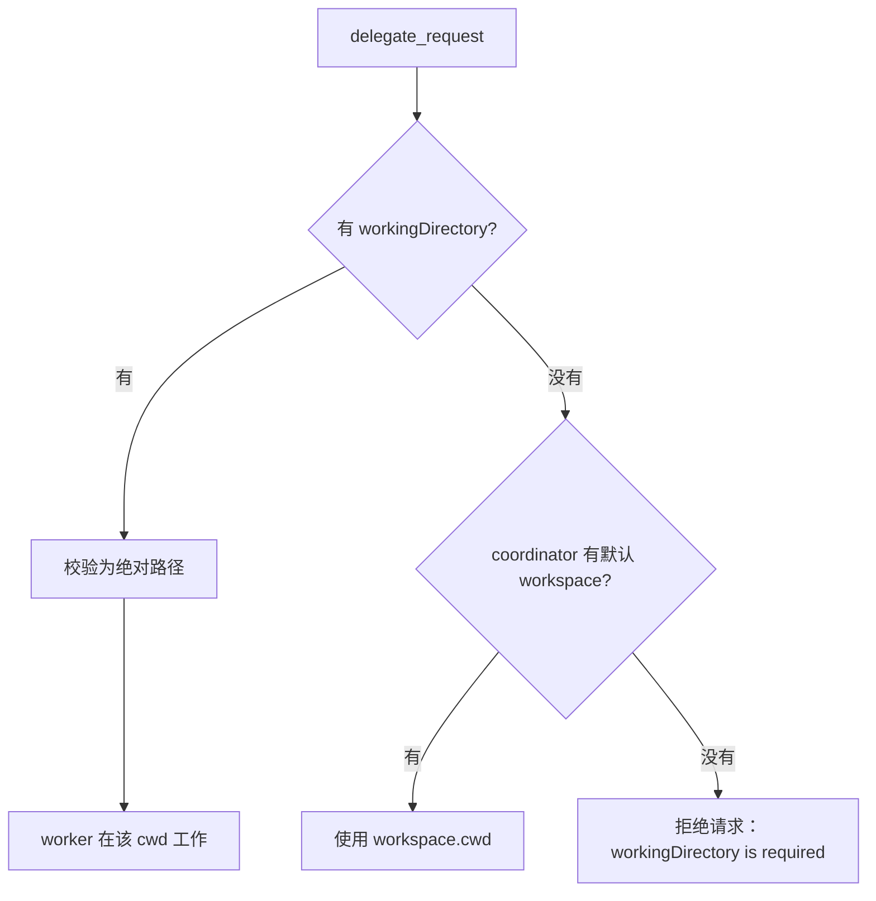
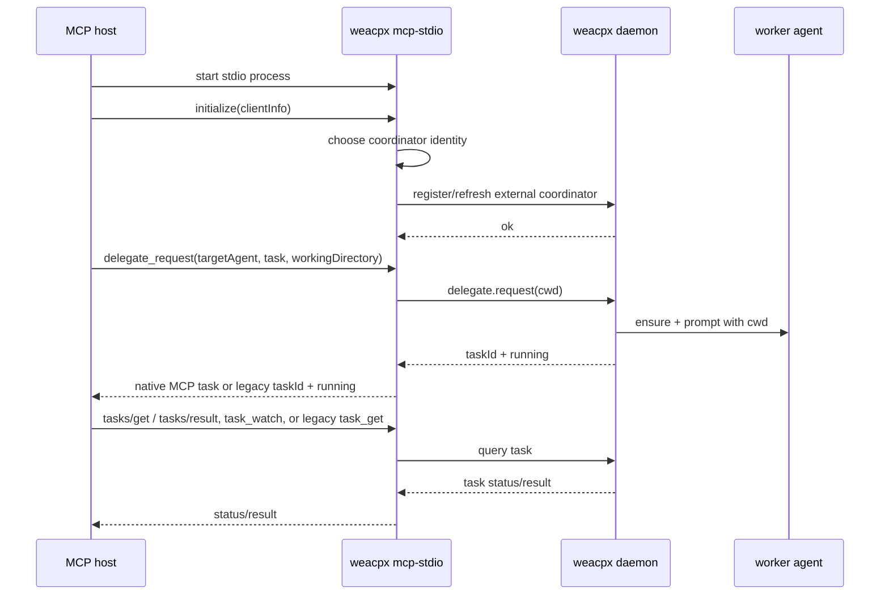

# External MCP coordinator

`weacpx mcp-stdio` 是标准 MCP stdio server。Codex、Claude Code 等外部 MCP host 可以通过它调用 weacpx 的编排工具，例如 `delegate_request`、`task_get`、`task_list`、`task_watch`。如果 host 支持 MCP Tasks，`delegate_request` 和 `task_watch` 也支持原生 task execution：call now、fetch later。

> 说明：定时任务的自然语言管理工具（`scheduled_create` / `scheduled_list` / `scheduled_cancel`）只给 weacpx 当前对话会话内部使用，用于复用当前聊天路由和群聊权限；外部 `weacpx mcp-stdio` 不会暴露这些工具。

核心目标：让“当前正在使用的 coding agent”成为 coordinator，把子任务派给其他 agent，同时让被派出去的 worker 明确知道自己应该在哪个目录工作。

## 一句话模型

- **MCP host / 当前 agent**：coordinator，负责拆任务和看结果。
- **`weacpx mcp-stdio`**：很薄的 stdio shim，只负责把 MCP tool call 转成 weacpx daemon 的本地 RPC。
- **weacpx daemon**：真正保存 coordinator、task、worker binding 等编排状态。
- **worker agent**：被 `delegate_request` 派出去的 Claude / Codex / opencode 会话。
- **`workingDirectory`**：任务级工作目录。它决定 worker 在哪里工作，不决定 coordinator identity。



## MCP Tasks 进展与输入请求

支持 MCP Tasks 的 host 应优先用 task-augmented `tools/call` 调用 `delegate_request`：

1. `delegate_request` 立即返回 native task handle。
2. 用 `tasks/get` 或 `tasks/list` 轮询；`statusMessage` 会包含任务摘要，以及 worker 输出的最新 `[PROGRESS] ...` 进展。也可以用 task-augmented `task_watch` 创建一个后台 watcher：watcher 自己是一个 native MCP task，达到下一条事件、需处理状态或 terminal 后，通过 `tasks/result` 取回 watch 结果。
3. 任务进入 `input_required` 时，调用 `tasks/result` 会立即返回一个下一步操作包并结束本次 result stream，不会一直阻塞等待 terminal。client 应按包里的建议调用 `task_get` 查看详情，再调用 `task_approve` / `task_cancel`（取消一个尚未批准的任务即拒绝）、`coordinator_answer_question` 或 `coordinator_review_contested_result`；处理后继续 `tasks/get` / `tasks/result`。
4. 任务进入 `completed` / `failed` / `cancelled` 后，再调用 `tasks/result` 获取最终结果。

不支持 MCP Tasks 的 host 使用兼容工具：`delegate_request` → `task_get` / `task_list` / `task_watch` / `task_cancel`。`task_watch` 是推荐的长轮询入口：它会阻塞到下一条事件、任务需要处理、任务结束或超时，并返回 `events` 和 `nextAfterSeq`；用返回的 `nextAfterSeq` 作为下一次 `afterSeq` 继续监听。`task_watch` 超时只表示“仍在运行”，再次调用即可继续等待，也可改用 `task_get` 查看一次性快照。

## 最小配置

先启动 daemon：

```bash
weacpx start
weacpx status
```

然后把 MCP server 配到外部 host：

```json
{
  "mcpServers": {
    "weacpx": {
      "command": "weacpx",
      "args": ["mcp-stdio"]
    }
  }
}
```

这时不需要 `--workspace`。weacpx 会给这个 MCP 子进程生成一个进程级 external coordinator identity，例如：

```text
external_codex-mcp-client:3f2a91c0
```

这个 identity 只表示“这个 MCP 子进程代表哪个 coordinator”，不绑定任何目录。

## 委派任务时传 workingDirectory

外部 MCP host 调用 `delegate_request` 时，应传入当前项目的绝对路径：

```json
{
  "targetAgent": "claude",
  "task": "审查当前改动，找出 3 个高风险点",
  "workingDirectory": "/absolute/path/to/repo"
}
```

Windows 示例：

```json
{
  "targetAgent": "claude",
  "task": "审查当前改动，找出 3 个高风险点",
  "workingDirectory": "E:\\projects\\weacpx"
}
```

要求：

- `workingDirectory` 必须是非空绝对路径。
- 这个路径不要求提前注册为 weacpx workspace。
- weacpx 不用 MCP roots 猜目录，也不会用 daemon 或 MCP 子进程的 `process.cwd()` 兜底。
- 如果 external coordinator 没有默认 workspace，`delegate_request` 不传 `workingDirectory` 会失败。

这是故意的：派遣任务时必须确定 worker 到底在哪里工作，不能靠不确定的 host 行为推断。

## 为什么不把 path 放进 coordinator identity

coordinator identity 和 worker cwd 是两个不同问题：

| 概念 | 作用 | 是否包含 path |
| --- | --- | --- |
| external coordinator identity | 标识“哪个 MCP host / MCP 子进程在当主控” | 默认不包含 |
| `workingDirectory` | 标识“这次派出去的 worker 到哪里工作” | 是 |
| worker session | 标识某个 target agent 在某个 coordinator + cwd 下的工作会话 | 会按 cwd 区分 |

如果把 path 放进 coordinator identity，会有两个问题：

1. 同一个 Codex / Claude Code 会话想派 agent 去另一个目录时，会被迫变成另一个 coordinator。
2. `task_get`、`task_list`、`task_watch` 这类只和 coordinator 相关的查询也会被 path 污染。

所以 weacpx 的规则是：

- coordinator identity 表示主控身份。
- `workingDirectory` 表示任务执行位置。
- worker session 会按 cwd 区分，避免同一个 coordinator 在不同目录派同一个 agent 时互相抢会话。



## 多开 Codex / Claude Code 会不会冲突

默认不会共用同一个 external coordinator。

不传 `--coordinator-session` 时，每个 `weacpx mcp-stdio` 进程会生成一个进程级 identity：

```text
external_<client-name>:<process-instance-id>
```

所以你在不同目录打开多个 Codex / Claude Code，通常每个 MCP stdio 子进程都会是独立 coordinator。它们可以分别在自己的 `workingDirectory` 下派任务。

如果你显式传了同一个 `--coordinator-session`，那就是你主动要求多个 MCP host 共享同一个 coordinator identity。只有在你确实想共享任务列表和编排上下文时才这样做。

## Windows 配置示例

不要把 `node E:\projects\weacpx\dist\cli.js` 整串写进 `command`。很多 MCP host 会把 `command` 当成文件名执行，从而报：

```text
文件名、目录名或卷标语法不正确。 (os error 123)
```

正确写法：`command` 只放可执行文件；脚本路径和参数放到 `args`。

```json
{
  "type": "stdio",
  "command": "D:\\Users\\you\\.nvmd\\versions\\22.19.0\\node.exe",
  "args": [
    "E:\\projects\\weacpx\\dist\\cli.js",
    "mcp-stdio"
  ]
}
```

如果全局安装了 `weacpx`，并且 MCP host 能找到它，也可以：

```json
{
  "type": "stdio",
  "command": "weacpx",
  "args": ["mcp-stdio"]
}
```

## 可选：显式 coordinator session

默认进程级 identity 适合大多数场景。如果你希望 MCP host 重启后继续使用同一个 coordinator identity，可以显式指定：

```json
{
  "mcpServers": {
    "weacpx": {
      "command": "weacpx",
      "args": ["mcp-stdio", "--coordinator-session", "codex:daily-review"]
    }
  }
}
```

效果：

- `task_list` 会看到这个固定 coordinator 之前留下的任务。
- 多个 MCP host 如果配置同一个 `--coordinator-session`，会共享同一组任务。
- 仍然建议每次 `delegate_request` 显式传 `workingDirectory`。

注意：不要随手让多个活跃 host 共用同一个 coordinator identity。除非你明确想共享编排上下文，否则默认进程级 identity 更安全。

## 可选：默认 workspace（兼容模式）

`--workspace` 仍然可用，但它只是给这个 MCP server 提供一个默认工作区，不是推荐的外部 MCP 配置方式：

```bash
weacpx mcp-stdio --workspace backend
```

这要求 `backend` 已经存在于 `~/.weacpx/config.json`：

```bash
cd /absolute/path/to/repo
weacpx workspace add backend
```

之后如果 `delegate_request` 没传 `workingDirectory`，weacpx 会使用 workspace `backend` 的 cwd。

这适合旧配置或非常固定的单仓库 MCP 配置；如果你经常在不同项目目录打开 Codex / Claude Code，建议不要在 MCP 启动参数里绑定 workspace，而是在 tool call 里传 `workingDirectory`。

## 为什么不依赖 MCP roots 或 process.cwd()

有些 MCP host 支持 roots，有些不支持；有些会返回多个 roots；有些 roots 只表示“打开的文件夹”，不一定等于当前 agent 真正要工作的目录。

`process.cwd()` 也不是可靠契约：它取决于 MCP host 如何启动 stdio server。某些 host 会在项目目录启动，某些 host 会在固定目录启动，还有些配置会经过 wrapper。

weacpx 的外部 MCP 选择更严格的规则：



这样可以保证派出去的 agent 的工作目录是确定的。

## 启动与调用流程



## 常用工具

外部 coordinator 常用工具：

- `delegate_request`：派出一个子任务。推荐传 `workingDirectory`。支持 MCP Tasks 的 host 可以请求 task execution，让该调用立即返回原生 task handle。
- `task_get`：查看单个任务。
- `task_list`：列出当前 coordinator 的任务。
- `task_watch`：长轮询一个任务，直到出现下一条事件、任务需要处理、任务结束或超时。返回 `events` 和 `nextAfterSeq`；继续监听时把 `nextAfterSeq` 作为下一次 `afterSeq`。默认最多等待 1 分钟；可传 `timeoutMs` 调整，最大 20 分钟。支持 MCP Tasks 的 host 可以对 `task_watch` 请求 task execution，让 watcher 作为后台 native MCP task 运行，之后用 `tasks/get` / `tasks/result` 取结果。
- `task_cancel`：取消任务。取消一个尚未批准的任务（状态为 `needs_confirmation`）等同于拒绝。取消一个 `queued` 任务（正在等待并行 slot）同样有效，立即生效，适合 coordinator 在任务开始执行前改变主意的场景。
- `delegate_batch`：一次派发多个子任务。传入一个 `tasks` 数组（每个条目含 `targetAgent`、`task`、`workingDirectory`），2 个及以上任务自动归入同一个组，所有任务达到终态后结果一并回注，无需手动维护 groupId 状态机。单个任务失败时带 `error` 字段返回，不影响其余任务。

## `parallel` 字段：并行委派

`delegate_request` 和 `delegate_batch` 的每个任务条目都支持可选的 `parallel: boolean` 字段（默认 `false`）。

- **`parallel: false`（默认）：** 任务复用目标 agent 的现有 session，行为与以往完全一致，多个任务串行执行。
- **`parallel: true`：** 任务在独立的临时 acpx session 中运行，可与同一 agent 的其他 `parallel: true` 任务并发执行。任务到达终态且无待审核项后，该临时 session 会自动关闭（`transport.removeSession` → `acpx <agent> sessions close <name>`）。

并行任务受 `orchestration.maxParallelTasksPerAgent`（默认 `3`）约束：当目标 agent 的并行 slot 已满时，新的 `parallel: true` 任务以 `status: "queued"` 创建，不占用 acpx session；有 slot 释放时自动按创建时间顺序升为 `running` 并开始执行。`queued` 状态的任务可通过 `task_watch` / `task_get` 正常跟踪，到达终态的路径与普通任务相同。注意：`queued` 任务仍计入 `maxPendingAgentRequestsPerCoordinator` 配额。

`delegate_request` 在顶层同样接受 `parallel` 字段，语义与 `delegate_batch` 中的单条任务一致。

`delegate_batch` 示例（`parallel` 逐条独立设置）：

```json
{
  "tasks": [
    { "targetAgent": "claude", "task": "审查 PR A", "workingDirectory": "/repo/a", "parallel": true },
    { "targetAgent": "claude", "task": "审查 PR B", "workingDirectory": "/repo/b", "parallel": true }
  ]
}
```

`task_get` / `task_list` / `task_watch` 不需要 `workingDirectory`，因为它们查的是 coordinator 名下的任务，不是新开 worker。

### MCP Tasks 原生状态映射

当 host 使用 MCP Tasks 时，weacpx 会把内部编排任务映射到协议状态：

| weacpx task status | MCP task status |
|---|---|
| `running` | `working` |
| `queued` | `working` | 任务正在等待并行 slot 释放；slot 可用后自动升为 `running` |
| `needs_confirmation` | `input_required` |
| `blocked` / `waiting_for_human` | `input_required` |
| 有 `reviewPending` 的任务 | `input_required` |
| `completed` | `completed` |
| `failed` | `failed` |
| `cancelled` | `cancelled` |

对应协议方法：

- `tasks/get`：查看状态。
- `tasks/list`：列出当前 coordinator 下的任务。
- `tasks/result`：读取 terminal task 的结果；如果任务处于 `input_required`，会立即返回一个可操作的说明包（例如下一步应调用 `task_get` 后再 `task_approve` / `coordinator_answer_question` / `coordinator_review_contested_result`），不会阻塞等待 terminal。
- `tasks/cancel`：取消任务，内部会转成 weacpx 的 `task_cancel`。

如果 worker 输出 `[PROGRESS] ...` 行，weacpx 会把最近一条进展持久化到 task 上；MCP Tasks 的 `tasks/get` / `tasks/list` 会在 `statusMessage` 中带上 `Latest progress` 和 `Last progress at`，兼容工具 `task_get` 也会显示最新进展。

不支持 MCP Tasks 的 host 仍然可以继续使用 `task_get` / `task_list` / `task_watch` / `task_cancel` 这些兼容工具；`task_watch` 提供长轮询，无需阻塞式的轮询循环。

### 长时间监听任务：`task_watch`

`task_watch` 面向“像 subagent task 一样长期监听”的场景，但仍保持 MCP tool call 可控：

- `mode: "next_event"`：有下一条事件就返回，适合实时刷进展。
- `mode: "until_attention_or_terminal"`：默认模式，忽略普通运行状态，直到任务需要 coordinator 处理、任务结束或超时。
- `afterSeq`：事件游标。第一次可省略或传 `0`；每次把返回的 `nextAfterSeq` 保存起来，下次继续传入，避免重复消费旧事件。
- `includeProgress`：是否包含 worker `[PROGRESS]` 事件；默认包含。
- `timeoutMs`：单次 watch 的最长等待时间，默认 60 秒，最大 20 分钟。

如果 host 支持 MCP Tasks，推荐对 `task_watch` 本身启用 task execution：调用会立即返回一个 watcher task handle，主 agent 可以继续推理；watch 条件满足后，host 可通过该 watcher 的 `tasks/result` 取到事件包。如果 host 不支持 MCP Tasks，就把 `task_watch` 当作长轮询工具，按 `nextAfterSeq` 续查。

## `sourceHandle` 的复用规则

对 coordinator 侧工具调用来说，如果 MCP host 没有显式绑定 `--source-handle`，weacpx 会把 `coordinatorSession` 复用为 `sourceHandle`。这是有意设计：对于 coordinator 发起的请求，这两个标识本来就指向同一个 session 身份。

只有 worker 侧的 `worker_raise_question` 需要一个单独绑定的 `sourceHandle`；如果 host 没有提供绑定，它会直接失败，而不会静默回退。

## 故障排查

### `cannot infer workspace from MCP roots`

旧版本或旧文档会建议依赖 roots 自动推导 workspace。现在推荐做法是不依赖 roots：

- MCP 启动参数用 `weacpx mcp-stdio`。
- 派任务时传 `workingDirectory`。

### `workingDirectory is required`

说明当前 external coordinator 没有默认 workspace，而 `delegate_request` 没传工作目录。

修法：让调用方补上：

```json
{
  "targetAgent": "claude",
  "task": "...",
  "workingDirectory": "/absolute/path/to/repo"
}
```

### `workingDirectory must be an absolute path`

传入了相对路径。改成绝对路径。

### Windows `os error 123`

`command` 写错了。不要把可执行文件和参数写成一整串；`command` 只写 `node.exe` 或 `weacpx`，其它放 `args`。

### `Cannot find module '...dist\\cli.js'`

脚本路径不存在或写错。先在终端里直接验证：

```powershell
& "D:\Users\you\.nvmd\versions\22.19.0\node.exe" "E:\projects\weacpx\dist\cli.js" "mcp-stdio"
```

如果本地开发版本还没 build，先运行：

```bash
bun run build
```

### 任务创建了但 worker 没结果

先查 daemon：

```bash
weacpx status
weacpx doctor --verbose
```

再查日志：

```bash
# macOS / Linux
 tail -n 200 ~/.weacpx/runtime/app.log

# Windows PowerShell
Get-Content C:\Users\you\.weacpx\runtime\app.log -Tail 200
```

常见原因：目标 agent 不可用、底层 acpx 启动失败、worker 会话被占用、权限策略阻止执行。

### Windows 上 mcp-stdio 残留进程

`weacpx mcp-stdio` 会监听 stdio 断开、`SIGINT`/`SIGTERM`/`SIGBREAK`，并每 5 秒检查父进程是否仍存活。触发退出时会向 stderr 写一行诊断，例如：

```text
[weacpx:mcp] mcp.stdio.shutdown {"reason":"parent_dead","parentPid":1234}
```

可用 `WEACPX_MCP_PARENT_CHECK_INTERVAL_MS` 调整父进程检查间隔（毫秒）；设为 `0` 可关闭父进程轮询，主要用于调试。

手工验证（Windows PowerShell）：启动一个父 Node 进程，让它创建 `weacpx mcp-stdio`，随后强杀父进程，观察子进程应在一个检查周期后退出。

```powershell
# 替换为你的 node/weacpx 路径；本地开发可用 node .\dist\cli.js
$script = @'
const { spawn } = require("node:child_process");
const child = spawn(process.argv[2], process.argv.slice(3), {
  stdio: ["pipe", "ignore", "inherit"],
  env: { ...process.env, WEACPX_MCP_PARENT_CHECK_INTERVAL_MS: "1000" },
});
console.log(child.pid);
setInterval(() => {}, 1000);
'@
$parent = Start-Process node -ArgumentList "-e", $script, "weacpx", "mcp-stdio" -PassThru -NoNewWindow
Stop-Process -Id $parent.Id -Force
# 等 2-3 秒后确认没有残留 weacpx mcp-stdio 进程。
Get-CimInstance Win32_Process | ? { $_.CommandLine -like "*weacpx* mcp-stdio*" } | Select-Object ProcessId,CommandLine
```
