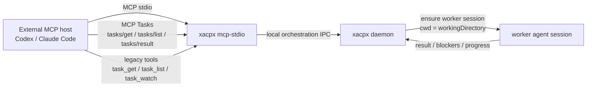
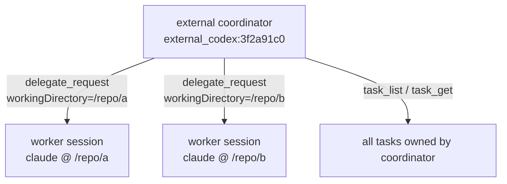
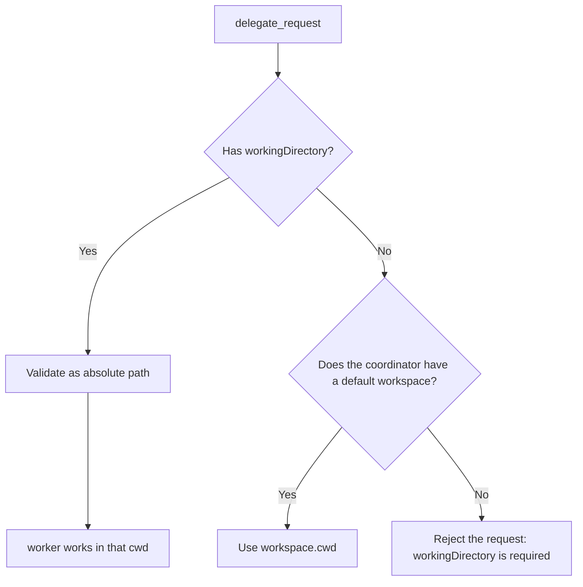

# External MCP coordinator

`xacpx mcp-stdio` is a standard MCP stdio server. External MCP hosts such as Codex and Claude Code can use it to call xacpx's orchestration tools, for example `delegate_request`, `task_get`, `task_list`, and `task_watch`. If the host supports MCP Tasks, `delegate_request` and `task_watch` also support native task execution: call now, fetch later.

> Note: the natural-language management tools for scheduled tasks (`scheduled_create` / `scheduled_list` / `scheduled_cancel`) are only available inside xacpx's current conversation session, where they reuse the current chat routing and group-chat permissions; the external `xacpx mcp-stdio` does not expose these tools.

Core goal: make the "coding agent you are currently using" the coordinator, dispatch subtasks to other agents, and at the same time let each dispatched worker know exactly which directory it should work in.

## One-sentence model

- **MCP host / current agent**: the coordinator, responsible for splitting tasks and reviewing results.
- **`xacpx mcp-stdio`**: a very thin stdio shim, responsible only for turning MCP tool calls into local RPC against the xacpx daemon.
- **xacpx daemon**: the one that actually holds the orchestration state, such as coordinators, tasks, and worker bindings.
- **worker agent**: a Claude / Codex / opencode session dispatched by `delegate_request`.
- **`workingDirectory`**: the task-level working directory. It determines where the worker works, not the coordinator identity.



## MCP Tasks progress and input requests

Hosts that support MCP Tasks should prefer calling `delegate_request` with a task-augmented `tools/call`:

1. `delegate_request` returns a native task handle immediately.
2. Poll with `tasks/get` or `tasks/list`; `statusMessage` includes the task summary plus the latest `[PROGRESS] ...` update emitted by the worker. You can also use a task-augmented `task_watch` to create a background watcher: the watcher is itself a native MCP task, and once it reaches the next event, a state that needs handling, or a terminal state, you retrieve the watch result via `tasks/result`.
3. When a task enters `input_required`, calling `tasks/result` immediately returns a next-step action package and ends this result stream, rather than blocking forever waiting for terminal. The client should follow the suggestions in the package and call `task_get` to view details, then call `task_approve` / `task_cancel` (cancelling a task that has not yet been approved is a rejection), `coordinator_answer_question`, or `coordinator_review_contested_result`; after handling, continue with `tasks/get` / `tasks/result`.
4. Once a task enters `completed` / `failed` / `cancelled`, call `tasks/result` again to obtain the final result.

Hosts that do not support MCP Tasks use the compatibility tools: `delegate_request` → `task_get` / `task_list` / `task_watch` / `task_cancel`. `task_watch` is the recommended long-polling entry point: it blocks until the next event, until the task needs handling, until the task finishes, or until timeout, and returns `events` and `nextAfterSeq`; use the returned `nextAfterSeq` as the next `afterSeq` to keep watching. A `task_watch` timeout only means "still running"; call it again to keep waiting, or switch to `task_get` for a one-shot snapshot.

## Minimal configuration

First start the daemon:

```bash
xacpx start
xacpx status
```

Then configure the MCP server in the external host:

```json
{
  "mcpServers": {
    "xacpx": {
      "command": "xacpx",
      "args": ["mcp-stdio"]
    }
  }
}
```

At this point you do not need `--workspace`. xacpx generates a process-level external coordinator identity for this MCP subprocess, for example:

```text
external_codex-mcp-client:3f2a91c0
```

This identity only indicates "which coordinator this MCP subprocess represents"; it is not bound to any directory.

## Pass workingDirectory when delegating a task

When an external MCP host calls `delegate_request`, it should pass the absolute path of the current project:

```json
{
  "targetAgent": "claude",
  "task": "审查当前改动，找出 3 个高风险点",
  "workingDirectory": "/absolute/path/to/repo"
}
```

Windows example:

```json
{
  "targetAgent": "claude",
  "task": "审查当前改动，找出 3 个高风险点",
  "workingDirectory": "C:\\path\\to\\your\\repo"
}
```

Requirements:

- `workingDirectory` must be a non-empty absolute path.
- This path is not required to be registered in advance as an xacpx workspace.
- xacpx does not guess the directory from MCP roots, nor does it fall back to the `process.cwd()` of the daemon or the MCP subprocess.
- If the external coordinator has no default workspace, calling `delegate_request` without `workingDirectory` will fail.

This is intentional: when dispatching a task you must determine exactly where the worker will work, and you cannot infer it from uncertain host behavior.

## Why path is not put into the coordinator identity

The coordinator identity and the worker cwd are two different problems:

| Concept | Role | Includes path |
| --- | --- | --- |
| external coordinator identity | Identifies "which MCP host / MCP subprocess is acting as coordinator" | Not by default |
| `workingDirectory` | Identifies "where the worker dispatched this time will work" | Yes |
| worker session | Identifies a working session of a given target agent under a given coordinator + cwd | Distinguished by cwd |

Putting the path into the coordinator identity would cause two problems:

1. When the same Codex / Claude Code session wants to dispatch an agent to another directory, it would be forced to become a different coordinator.
2. Queries that are only related to the coordinator, such as `task_get`, `task_list`, and `task_watch`, would also be polluted by the path.

So the xacpx rule is:

- The coordinator identity represents the coordinator identity.
- `workingDirectory` represents the task execution location.
- The worker session is distinguished by cwd, to avoid the same coordinator competing for sessions when dispatching the same agent to different directories.



## Will opening multiple Codex / Claude Code instances conflict

By default they do not share the same external coordinator.

When `--coordinator-session` is not passed, each `xacpx mcp-stdio` process generates a process-level identity:

```text
external_<client-name>:<process-instance-id>
```

So when you open multiple Codex / Claude Code instances in different directories, each MCP stdio subprocess is usually an independent coordinator. They can each dispatch tasks under their own `workingDirectory`.

If you explicitly pass the same `--coordinator-session`, then you are actively requesting that multiple MCP hosts share the same coordinator identity. Only do this when you really want to share the task list and orchestration context.

## Windows configuration example

Do not write the whole string `node C:\path\to\xacpx\dist\cli.js` into `command`. Many MCP hosts execute `command` as a filename, which then reports:

```text
文件名、目录名或卷标语法不正确。 (os error 123)
```

The correct approach: `command` holds only the executable; the script path and arguments go into `args`.

```json
{
  "type": "stdio",
  "command": "C:\\Program Files\\nodejs\\node.exe",
  "args": [
    "C:\\path\\to\\xacpx\\dist\\cli.js",
    "mcp-stdio"
  ]
}
```

If `xacpx` is installed globally and the MCP host can find it, you can also use:

```json
{
  "type": "stdio",
  "command": "xacpx",
  "args": ["mcp-stdio"]
}
```

## Optional: explicit coordinator session

The default process-level identity is suitable for most scenarios. If you want the MCP host to keep using the same coordinator identity after a restart, you can specify it explicitly:

```json
{
  "mcpServers": {
    "xacpx": {
      "command": "xacpx",
      "args": ["mcp-stdio", "--coordinator-session", "codex:daily-review"]
    }
  }
}
```

Effect:

- `task_list` will see the tasks previously left by this fixed coordinator.
- If multiple MCP hosts are configured with the same `--coordinator-session`, they will share the same set of tasks.
- It is still recommended to explicitly pass `workingDirectory` on every `delegate_request`.

Note: do not casually let multiple active hosts share the same coordinator identity. Unless you explicitly want to share the orchestration context, the default process-level identity is safer.

## Optional: default workspace (compatibility mode)

`--workspace` is still available, but it only provides a default workspace for this MCP server; it is not the recommended way to configure an external MCP:

```bash
xacpx mcp-stdio --workspace backend
```

This requires `backend` to already exist in `~/.xacpx/config.json`:

```bash
cd /absolute/path/to/repo
xacpx workspace add backend
```

After that, if `delegate_request` does not pass `workingDirectory`, xacpx uses the cwd of the workspace `backend`.

This suits legacy configurations or a very fixed single-repository MCP configuration; if you frequently open Codex / Claude Code in different project directories, it is recommended not to bind a workspace in the MCP launch arguments, but instead to pass `workingDirectory` in the tool call.

## Why MCP roots or process.cwd() is not relied upon

Some MCP hosts support roots, some do not; some return multiple roots; some roots only indicate "the opened folder", which is not necessarily the directory where the current agent actually needs to work.

`process.cwd()` is also not a reliable contract: it depends on how the MCP host starts the stdio server. Some hosts start in the project directory, some hosts start in a fixed directory, and some configurations go through a wrapper.

xacpx's external MCP chooses a stricter rule:



This guarantees that the working directory of the dispatched agent is deterministic.

## Startup and call flow


## Common tools

Tools commonly used by external coordinators:

- `delegate_request`: dispatch a single subtask. Passing `workingDirectory` is recommended. Hosts that support MCP Tasks can request task execution so that the call returns a native task handle immediately.
- `task_get`: view a single task's summary, latest progress, and the worker's final result after a terminal state. By default it **does not echo** the original prompt from dispatch (only `needs_confirmation` tasks show it, so that the approver can confirm what is about to be executed); pass `includePrompt: true` when you need to re-read the original text. To follow a task, prefer `task_watch` (terminal states carry the result); `task_get` is mainly for retrieving a task, viewing pending items, or re-reading the prompt.
- `task_list`: list the tasks of the current coordinator.
- `task_watch`: long-poll a single task until the next event appears, until the task needs handling, until the task finishes, or until timeout. Returns `events` and `nextAfterSeq`; to keep watching, pass `nextAfterSeq` as the next `afterSeq`. **On a terminal state it directly carries the worker's final result (`- Result:`), and on attention it directly carries the open question (`- Open question:`), so under normal circumstances there is no need to call `task_get` to wrap up.** By default it waits up to 1 minute; pass `timeoutMs` to adjust, up to a maximum of 20 minutes. Hosts that support MCP Tasks can request task execution for `task_watch`, letting the watcher run as a background native MCP task, then fetch the result with `tasks/get` / `tasks/result`.
- `task_cancel`: cancel a task. Cancelling a task that has not yet been approved (status `needs_confirmation`) is equivalent to rejecting it. Cancelling a `queued` task (waiting for a parallel slot) is also valid and takes effect immediately, suitable for the scenario where the coordinator changes its mind before the task starts executing.
- `delegate_batch`: dispatch multiple subtasks at once. Pass a `tasks` array (each entry contains `targetAgent`, `task`, `workingDirectory`); 2 or more tasks are automatically grouped together, and once all tasks reach a terminal state the results are injected back together, with no need to manually maintain a groupId state machine. When a single task fails it is returned with an `error` field, without affecting the rest of the tasks.

## The `parallel` field: parallel delegation

Each task entry of `delegate_request` and `delegate_batch` supports an optional `parallel: boolean` field (default `false`).

- **`parallel: false` (default):** the task reuses the target agent's existing session, behaving exactly as before, with multiple tasks executing serially.
- **`parallel: true`:** the task runs in an independent temporary acpx session and can run concurrently with the agent's other `parallel: true` tasks. After the task reaches a terminal state with no pending review items, the temporary session is automatically closed (`transport.removeSession` → `acpx <agent> sessions close <name>`).

Parallel tasks are constrained by `orchestration.maxParallelTasksPerAgent` (default `3`): when the target agent's parallel slots are full, a new `parallel: true` task is created with `status: "queued"` and does not occupy an acpx session; when a slot is released, tasks are automatically promoted to `running` in creation-time order and start executing. Tasks in the `queued` state can be tracked normally via `task_watch` / `task_get`, and reach a terminal state along the same path as ordinary tasks. Note: `queued` tasks still count toward the `maxPendingAgentRequestsPerCoordinator` quota.

`delegate_request` also accepts a `parallel` field at the top level, with the same semantics as a single task entry within `delegate_batch`.

`delegate_batch` example (`parallel` set independently per entry):

```json
{
  "tasks": [
    { "targetAgent": "claude", "task": "审查 PR A", "workingDirectory": "/repo/a", "parallel": true },
    { "targetAgent": "claude", "task": "审查 PR B", "workingDirectory": "/repo/b", "parallel": true }
  ]
}
```

`task_get` / `task_list` / `task_watch` do not need `workingDirectory`, because they query the tasks owned by the coordinator, not the opening of a new worker.

### Native status mapping for MCP Tasks

When the host uses MCP Tasks, xacpx maps internal orchestration tasks to protocol statuses:

| xacpx task status | MCP task status |
|---|---|
| `running` | `working` |
| `queued` | `working` | the task is waiting for a parallel slot to be released; once a slot is available it is automatically promoted to `running` |
| `needs_confirmation` | `input_required` |
| `blocked` / `waiting_for_human` | `input_required` |
| a task with `reviewPending` | `input_required` |
| `completed` | `completed` |
| `failed` | `failed` |
| `cancelled` | `cancelled` |

Corresponding protocol methods:

- `tasks/get`: view status.
- `tasks/list`: list the tasks under the current coordinator.
- `tasks/result`: read the result of a terminal task; if the task is in `input_required`, it immediately returns an actionable explanation package (for example, the next step should be to call `task_get` and then `task_approve` / `coordinator_answer_question` / `coordinator_review_contested_result`), rather than blocking to wait for terminal.
- `tasks/cancel`: cancel a task, internally converted to xacpx's `task_cancel`.

If the worker outputs `[PROGRESS] ...` lines, xacpx persists the most recent progress to the task; MCP Tasks' `tasks/get` / `tasks/list` will include `Latest progress` and `Last progress at` in `statusMessage`, and the compatibility tool `task_get` will also show the latest progress.

Hosts that do not support MCP Tasks can still continue to use the compatibility tools `task_get` / `task_list` / `task_watch` / `task_cancel`; `task_watch` provides long-polling, with no need for a blocking polling loop.

### Long-running task watching: `task_watch`

`task_watch` targets scenarios of "long-running watching like a subagent task", while still keeping the MCP tool call controllable:

- `mode: "next_event"`: return as soon as there is a next event, suitable for real-time progress refreshing.
- `mode: "until_attention_or_terminal"`: the default mode, which ignores ordinary running states until the task needs coordinator handling, the task finishes, or timeout.
- `afterSeq`: the event cursor. You can omit it or pass `0` the first time; each time, save the returned `nextAfterSeq` and pass it again next time, to avoid re-consuming old events.
- `includeProgress`: whether to include worker `[PROGRESS]` events; included by default.
- `timeoutMs`: the maximum wait time for a single watch, default 60 seconds, maximum 20 minutes.

If the host supports MCP Tasks, it is recommended to enable task execution for `task_watch` itself: the call returns a watcher task handle immediately, and the main agent can continue reasoning; once the watch condition is met, the host can retrieve the event package via the watcher's `tasks/result`. If the host does not support MCP Tasks, treat `task_watch` as a long-polling tool and continue querying by `nextAfterSeq`.

The watch return already carries the complete task record, so **on a terminal stop it directly gives `- Result:`, and on an attention stop it directly gives `- Open question:`**, so the coordinator does not need to separately call `task_get` to wrap up — `task_get` degenerates into an on-demand tool for "retrieving a task / re-reading the prompt / viewing more details". To watch a long task "for as long as it takes", do not set a single `timeoutMs` to infinite; instead continue querying by `nextAfterSeq` (the total duration is unbounded, while each call remains bounded), or use a background watcher on a host that supports MCP Tasks (so the main agent does not have to repeatedly initiate calls).

## Reuse rule for `sourceHandle`

For coordinator-side tool calls, if the MCP host does not explicitly bind `--source-handle`, xacpx reuses `coordinatorSession` as `sourceHandle`. This is intentional: for requests initiated by the coordinator, these two identifiers point to the same session identity to begin with.

Only the worker-side `worker_raise_question` needs a separately bound `sourceHandle`; if the host does not provide a binding, it fails outright rather than silently falling back.

## Troubleshooting

### `cannot infer workspace from MCP roots`

Older versions or older docs suggested relying on roots to auto-derive the workspace. The recommended approach now is to not rely on roots:

- Use `xacpx mcp-stdio` for the MCP launch arguments.
- Pass `workingDirectory` when dispatching a task.

### `workingDirectory is required`

This means the current external coordinator has no default workspace, and `delegate_request` did not pass a working directory.

Fix: have the caller supply it:

```json
{
  "targetAgent": "claude",
  "task": "...",
  "workingDirectory": "/absolute/path/to/repo"
}
```

### `workingDirectory must be an absolute path`

A relative path was passed. Change it to an absolute path.

### Windows `os error 123`

`command` is written incorrectly. Do not write the executable and the arguments as a single string; `command` holds only `node.exe` or `xacpx`, and the rest goes into `args`.

### `Cannot find module '...dist\\cli.js'`

The script path does not exist or is written incorrectly. First verify it directly in the terminal:

```powershell
& "C:\Program Files\nodejs\node.exe" "C:\path\to\xacpx\dist\cli.js" "mcp-stdio"
```

If the local development version has not been built yet, first run:

```bash
bun run build
```

### Task created but the worker has no result

First check the daemon:

```bash
xacpx status
xacpx doctor --verbose
```

Then check the logs:

```bash
# macOS / Linux
 tail -n 200 ~/.xacpx/runtime/app.log

# Windows PowerShell
Get-Content ~/.xacpx/runtime/app.log -Tail 200
```

Common causes: the target agent is unavailable, the underlying acpx failed to start, the worker session is occupied, or the permission policy blocked execution.

### Leftover mcp-stdio processes on Windows

`xacpx mcp-stdio` listens for stdio disconnect, `SIGINT`/`SIGTERM`/`SIGBREAK`, and checks every 5 seconds whether the parent process is still alive. When triggered to exit, it writes a diagnostic line to stderr, for example:

```text
[xacpx:mcp] mcp.stdio.shutdown {"reason":"parent_dead","parentPid":1234}
```

You can use `WEACPX_MCP_PARENT_CHECK_INTERVAL_MS` to adjust the parent-process check interval (in milliseconds); set it to `0` to disable parent-process polling, mainly for debugging.

Manual verification (Windows PowerShell): start a parent Node process, have it create `xacpx mcp-stdio`, then force-kill the parent process, and observe that the child process should exit after one check cycle.

```powershell
# Replace with your node/xacpx path; for local development you can use node .\dist\cli.js
$script = @'
const { spawn } = require("node:child_process");
const child = spawn(process.argv[2], process.argv.slice(3), {
  stdio: ["pipe", "ignore", "inherit"],
  env: { ...process.env, WEACPX_MCP_PARENT_CHECK_INTERVAL_MS: "1000" },
});
console.log(child.pid);
setInterval(() => {}, 1000);
'@
$parent = Start-Process node -ArgumentList "-e", $script, "xacpx", "mcp-stdio" -PassThru -NoNewWindow
Stop-Process -Id $parent.Id -Force
# After waiting 2-3 seconds, confirm there are no leftover xacpx mcp-stdio processes.
Get-CimInstance Win32_Process | ? { $_.CommandLine -like "*xacpx* mcp-stdio*" } | Select-Object ProcessId,CommandLine
```
